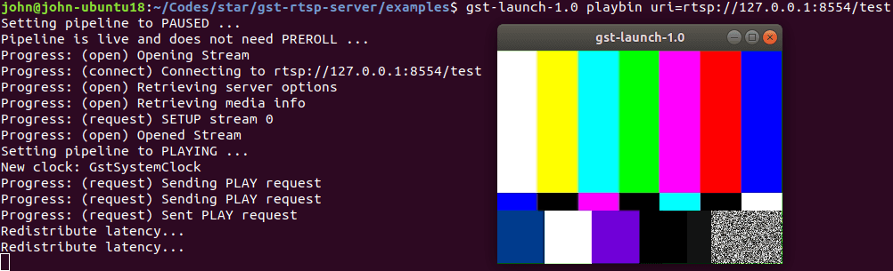

# Send and receive RTSP stream

## Prerequisites

- [Ubuntu 18.04 LTS (Bionic Beaver)](http://releases.ubuntu.com/bionic/)

## [GStreamer][]

[GStreamer]: https://gstreamer.freedesktop.org/
[GStreamer RTSP Server]: https://gitlab.freedesktop.org/gstreamer/gst-rtsp-server

Install:

```bash
sudo apt install libgstreamer1.0-0 gstreamer1.0-plugins-base gstreamer1.0-plugins-good gstreamer1.0-plugins-bad gstreamer1.0-plugins-ugly gstreamer1.0-libav gstreamer1.0-doc gstreamer1.0-tools gstreamer1.0-x gstreamer1.0-alsa gstreamer1.0-gl gstreamer1.0-gtk3 gstreamer1.0-qt5 gstreamer1.0-pulseaudio
```

Print all plugins and elements:

```bash
# conda deactivate
gst-inspect-1.0 -a
```

Play `~/Videos/test.mp4` file:

```bash
gst-launch-1.0 filesrc location=~/Videos/test.mp4 ! decodebin ! autovideosink
```

Play `/dev/video0` webcam:

```bash
gst-launch-1.0 v4l2src device=/dev/video0 \
! video/x-raw, format=YUY2, width=640, height=480, framerate=30/1 \
! autovideosink
```

See section [About Webcam](#About-Webcam) below for more information about `/dev/video0`.

### [GStreamer RTSP Server][]

Build `test-launch` example:

```bash
sudo apt install libgstreamer1.0-dev libgstrtspserver-1.0

git clone https://github.com/GStreamer/gst-rtsp-server.git

cd gst-rtsp-server/
git checkout 1.18

cd examples/
gcc test-launch.c -o test-launch $(pkg-config --cflags --libs gstreamer-rtsp-server-1.0)
```

<!--
pip install meson
pkg-config --modversion gstreamer-rtsp-server-1.0
-->

Send RTSP test stream with `test-launch`:

```bash
$ ./test-launch "videotestsrc ! x264enc ! rtph264pay name=pay0 pt=96"
stream ready at rtsp://127.0.0.1:8554/test
```

Recv RTSP test stream with `gst-launch`:

```bash
gst-launch-1.0 playbin uri=rtsp://127.0.0.1:8554/test
```



### Send RTSP with `test-launch`

Send `~/Videos/test.mp4` file:

```bash
./test-launch "filesrc location=/home/john/Videos/test.mp4 ! decodebin ! x264enc ! rtph264pay name=pay0 pt=96"
```

Send `/dev/video0` webcam:

```bash
./test-launch "v4l2src device=/dev/video0 ! video/x-raw,format=YUY2,width=640,height=480 ! videoconvert ! x264enc ! rtph264pay name=pay0 pt=96"
```

### Recv RTSP with `gst-launch`

```bash
gst-launch-1.0 playbin uri=rtsp://127.0.0.1:8554/test
# or
gst-launch-1.0 rtspsrc location=rtsp://127.0.0.1:8554/test ! decodebin ! autovideosink
```

### See also

- [GStreamer][]
  - [Installing on Linux](https://gstreamer.freedesktop.org/documentation/installing/on-linux.html)
  - [Command line tools](https://gstreamer.freedesktop.org/documentation/tools/index.html)
  - [Plugins](https://gstreamer.freedesktop.org/documentation/plugins_doc.html)
- [GStreamer RTSP Server][]
- [Stream webcam with GStreamer (RTSP)](https://stackoverflow.com/questions/59068026/stream-webcam-with-gstreamer-rtsp)
- [x264 [error]: baseline profile doesn't support 4:2:2](http://gstreamer-devel.966125.n4.nabble.com/x264-error-baseline-profile-doesn-t-support-4-2-2-td4689099.html)

## [VLC][]

[VLC]: https://www.videolan.org/vlc/

Install:

```bash
sudo snap install vlc
# allow camera permission
snap connect vlc:camera :camera
```

<!--
sudo apt install vlc-bin
sudo usermod -aG video ${USER}
-->

List all the available modules:

```bash
vlc --list
```

Play `~/Videos/test.mp4` file:

```bash
vlc file:///home/john/Videos/test.mp4
```

Play `/dev/video0` webcam:

```bash
vlc v4l2:///dev/video0:chroma=mjpg:width=640:height=480:fps=30
```

### Send RTSP with `vlc`

Send `~/Videos/test.mp4` file:

```bash
vlc file:///home/john/Videos/test.mp4 \
--sout '#transcode{vcodec=h264}:rtp{sdp=rtsp://:8554/test}'
```

Send `/dev/video0` webcam:

```bash
vlc v4l2:///dev/video0:chroma=yuyv:width=640:height=480:fps=30 \
--sout '#transcode{vcodec=h264,width=640,height=480}:rtp{sdp=rtsp://:8554/test}'
```

### Recv RTSP  with `vlc`

```bash
vlc rtsp://127.0.0.1:8554/test
```

### See also

- [VLC][]
  - [Modules/file](https://wiki.videolan.org/Documentation:Modules/file/)
  - [Modules/v4l2](https://wiki.videolan.org/Documentation:Modules/v4l2/)
  - [Streaming HowTo/Advanced Streaming Using the Command Line](https://wiki.videolan.org/Documentation:Streaming_HowTo/Advanced_Streaming_Using_the_Command_Line/)
  - [Streaming HowTo/Command Line Examples](https://wiki.videolan.org/Documentation:Streaming_HowTo/Command_Line_Examples)
- [Ubuntu 18.04 Webcam streaming problem](https://askubuntu.com/questions/1224092/ubuntu-18-04-webcam-streaming-problem)

## [FFmpeg][]

[FFmpeg]: http://www.ffmpeg.org/

Install:

```bash
sudo apt install ffmpeg
```

### Send RTSP with [ffserver][]

[ffserver]: http://trac.ffmpeg.org/wiki/ffserver

Edit `ffserver.conf`:

```conf
HTTPPort 8091
HTTPBindAddress 0.0.0.0
RTSPPort 1554
MaxHTTPConnections 2000
MaxClients 1000
MaxBandwidth 1000
CustomLog -

<Stream test.mp4>
  File "/home/john/Videos/test.mp4"
  Format rtp
</Stream>
```

Start [ffserver][]:

```bash
$ nohup ffserver -f ffserver.conf &

$ tail nohup.out
  libavcodec     57.107.100 / 57.107.100
  libavformat    57. 83.100 / 57. 83.100
  libavdevice    57. 10.100 / 57. 10.100
  libavfilter     6.107.100 /  6.107.100
  libavresample   3.  7.  0 /  3.  7.  0
  libswscale      4.  8.100 /  4.  8.100
  libswresample   2.  9.100 /  2.  9.100
  libpostproc    54.  7.100 / 54.  7.100
Wed Apr 21 11:28:39 2021 Opening feed file '/home/john/Videos/test.mp4' for stream 'test.mp4'
Wed Apr 21 11:28:39 2021 FFserver started.
```

### Recv RTSP  with `ffplay`

```bash
ffplay rtsp://127.0.0.1:1554/test.mp4
```

### See also

- [FFmpeg][]
  - [ffserver][]
- [Streaming RTSP with ffmpeg?](https://superuser.com/questions/1420328/streaming-rtsp-with-ffmpeg)
- [Run real time streaming with ffserver?](https://stackoverflow.com/questions/37403282/is-there-anyone-who-can-successfully-run-real-time-streaming-with-ffserver)

## About Media

```bash
$ sudo apt install ffmpeg

$ ffprobe ~/Videos/test.mp4
ffprobe version 3.4.8-0ubuntu0.2 Copyright (c) 2007-2020 the FFmpeg developers
  built with gcc 7 (Ubuntu 7.5.0-3ubuntu1~18.04)
  configuration: --prefix=/usr --extra-version=0ubuntu0.2 --toolchain=hardened --libdir=/usr/lib/x86_64-linux-gnu --incdir=/usr/include/x86_64-linux-gnu --enable-gpl --disable-stripping --enable-avresample --enable-avisynth --enable-gnutls --enable-ladspa --enable-libass --enable-libbluray --enable-libbs2b --enable-libcaca --enable-libcdio --enable-libflite --enable-libfontconfig --enable-libfreetype --enable-libfribidi --enable-libgme --enable-libgsm --enable-libmp3lame --enable-libmysofa --enable-libopenjpeg --enable-libopenmpt --enable-libopus --enable-libpulse --enable-librubberband --enable-librsvg --enable-libshine --enable-libsnappy --enable-libsoxr --enable-libspeex --enable-libssh --enable-libtheora --enable-libtwolame --enable-libvorbis --enable-libvpx --enable-libwavpack --enable-libwebp --enable-libx265 --enable-libxml2 --enable-libxvid --enable-libzmq --enable-libzvbi --enable-omx --enable-openal --enable-opengl --enable-sdl2 --enable-libdc1394 --enable-libdrm --enable-libiec61883 --enable-chromaprint --enable-frei0r --enable-libopencv --enable-libx264 --enable-shared
  libavutil      55. 78.100 / 55. 78.100
  libavcodec     57.107.100 / 57.107.100
  libavformat    57. 83.100 / 57. 83.100
  libavdevice    57. 10.100 / 57. 10.100
  libavfilter     6.107.100 /  6.107.100
  libavresample   3.  7.  0 /  3.  7.  0
  libswscale      4.  8.100 /  4.  8.100
  libswresample   2.  9.100 /  2.  9.100
  libpostproc    54.  7.100 / 54.  7.100
Input #0, mov,mp4,m4a,3gp,3g2,mj2, from '/home/john/Videos/test.mp4':
  Metadata:
    major_brand     : isom
    minor_version   : 512
    compatible_brands: isomiso2avc1mp41
    encoder         : Lavf58.20.100
  Duration: 00:10:22.04, start: 0.000000, bitrate: 4205 kb/s
    Stream #0:0(und): Video: h264 (Main) (avc1 / 0x31637661), yuv420p, 1920x1080, 4204 kb/s, 25 fps, 25 tbr, 1200k tbn, 2400k tbc (default)
    Metadata:
      handler_name    : VideoHandler
```

- [ffprobe](https://ffmpeg.org/ffprobe.html)

## About Webcam

```bash
$ sudo apt install v4l-utils

$ v4l2-ctl --list-devices
HD Webcam: HD Webcam (usb-0000:00:14.0-13):
	/dev/video0
	/dev/video1

$ v4l2-ctl -d 0 --list-formats-ext
ioctl: VIDIOC_ENUM_FMT
	Index       : 0
	Type        : Video Capture
	Pixel Format: 'MJPG' (compressed)
	Name        : Motion-JPEG
		Size: Discrete 640x480
			Interval: Discrete 0.033s (30.000 fps)
		Size: Discrete 1280x720
			Interval: Discrete 0.033s (30.000 fps)
		Size: Discrete 640x360
			Interval: Discrete 0.033s (30.000 fps)
		Size: Discrete 352x288
			Interval: Discrete 0.033s (30.000 fps)
		Size: Discrete 320x240
			Interval: Discrete 0.033s (30.000 fps)
		Size: Discrete 176x144
			Interval: Discrete 0.033s (30.000 fps)
		Size: Discrete 160x120
			Interval: Discrete 0.033s (30.000 fps)

	Index       : 1
	Type        : Video Capture
	Pixel Format: 'YUYV'
	Name        : YUYV 4:2:2
		Size: Discrete 640x480
			Interval: Discrete 0.033s (30.000 fps)
			Interval: Discrete 0.050s (20.000 fps)
		Size: Discrete 1280x720
			Interval: Discrete 0.100s (10.000 fps)
		Size: Discrete 640x360
			Interval: Discrete 0.033s (30.000 fps)
		Size: Discrete 352x288
			Interval: Discrete 0.033s (30.000 fps)
		Size: Discrete 320x240
			Interval: Discrete 0.033s (30.000 fps)
		Size: Discrete 176x144
			Interval: Discrete 0.033s (30.000 fps)
		Size: Discrete 160x120
			Interval: Discrete 0.033s (30.000 fps)
```
